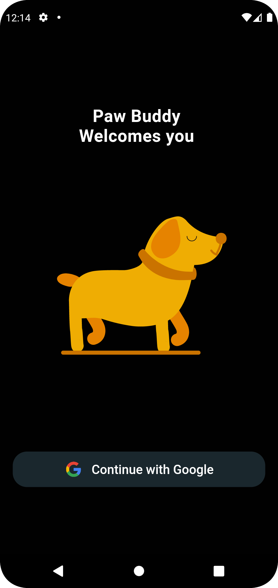
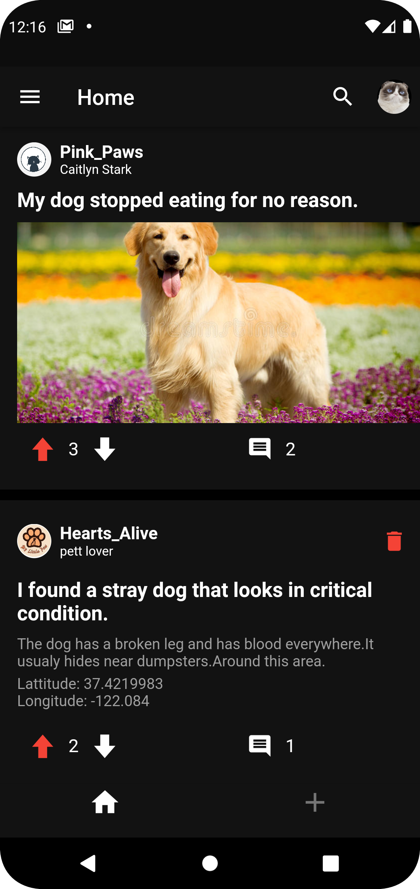
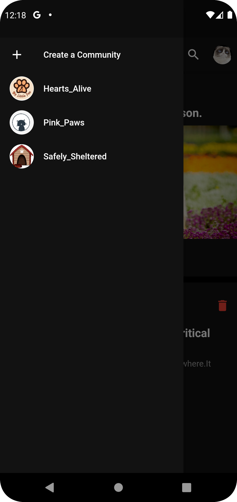
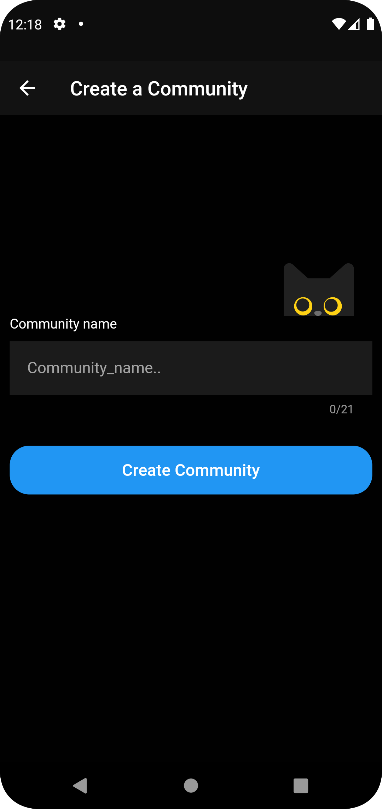
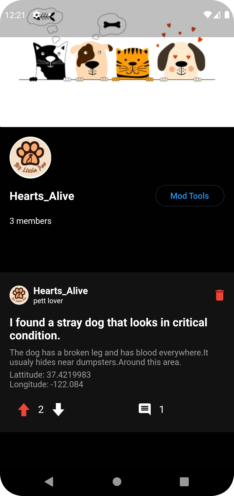
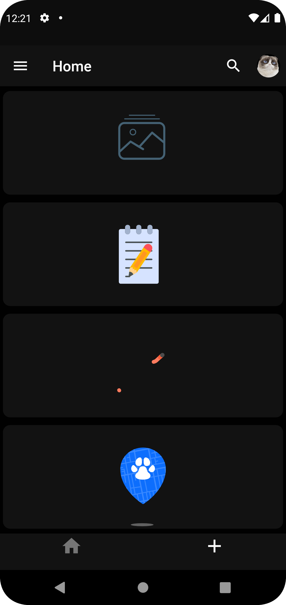
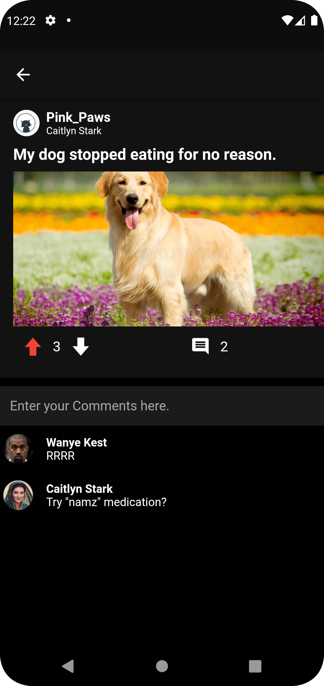

Paw-Buddy is a mobile application developed using flutter and firebase for the database.it helps rescuing injured, stray,
homeless pets and even help normal users with pet issues.

There is 1 actor who can access  specific functionalities:

  -Login
  -Create Community
  -Posting 
  -commenting
  -Like/Disliking a post
  -join/leave community
  -Along Side the other Features like change name/profile or cover picture ect..
  
there are 4 types of Posts each grant the user poinnts:
  the first three Which you can post in normal communities:
    1-Image(3 Points)
    2-Text (2 Points)
    3-Link (3 Points)
  and the fourth  
    4-Demand (10 Points),
    When a person finds a stray or injured animal can use this and a list of Agencies which he is a part of will appear.
Communities Are Seperated into 2:
  -Communities
  -Agencies
You can chose to join,Leave or create a community on your own and Add moderators which allows them to change cover or delete posts in that particular community.

Here are some screenshots of the application.

